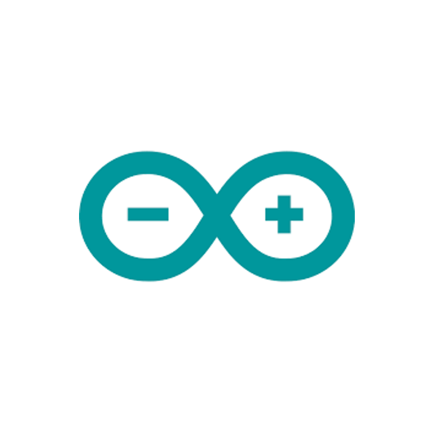

<br>
<div align="center">
    <div >
        
    </div>
    <div>
            <h3><b>HeadHome</b></h3>
            <p><i>Your companion, every step of the way</i></p>
    </div>      
</div>
<br>
<h1 align="center">HeadHome Hardware</h1>

<div align="center">

</div>
<br />

The **HeadHome wearable** is responsible for
enabling the dementia patient to seek for help and providing directions when they are lost. Having an avenue to reach out for help within their fingertips via the wearable heavily nullifies the repercussions of dementia wandering and ensures that our dementia counterparts are well taken care of.

The HeadHome wearable was crafted using _Computer-Aided Design_ and _3D Printing technologies_. Here are the links to the [STL](./HeadHome%20Watch%20Case.stl) and [STEP](./HeadHome%20Watch%20Case.step) files for the casing.

<h2>👨🏻‍💻 Technology Stack</h2>

<div align="center">
  <a href="https://www.arduino.cc/">
    <kbd>
      
    </kbd>
  </a>
  <a href="https://cplusplus.com/">
    <kbd>
      
    </kbd>
  </a>
  <a href="https://www.espressif.com/en/products/socs/esp32">
    <kbd>
      
    </kbd>
  </a>
  <a href="https://arduinojson.org/">
    <kbd>
      
    </kbd>
  </a>
  <br />
  <h4>Arduino | C++ | ESP32 | ArduinoJSON</h4>
</div>
<br />

<h2> 🛠️ &nbsp;Key Functionalities </h2>


## 1. Request for help

Whenever the dementia patient is lost, `pressing the red button` on the wearable sends a notification to the Caregiver, alerting the Caregiver of their precarious situation.

## 2. Directions to Home

In addition, upon `pressing the red button`, the wearable displays an optimal path to guide the patient back home.

# Getting Started

This repo contains the Hardware Program for HeadHome. Click [here](https://github.com/GSC23-HeadHome/HeadHome) to view the full solution.

## ⚙️ Steps to Setup

1. Install the Arduino IDE from the link [here](https://www.arduino.cc/en/software).
2. Clone this repository and open [headhome-hardware.ino](headhome-hardware.ino) in the Arduino IDE
3. Upload the code onto your ESP32 to run the code.

## 🔑 &nbsp;Files and Directories

```tree
├── assets
├── utils
├── .gitignore
├── headhome-hardware.ino
├── HeadHome Watch Case.step
├── HeadHome Watch Case.stl
└── README.md
```

## 🔗 &nbsp;Useful External Links

1. Image to arduino bitmap converter [link](https://javl.github.io/image2cpp/)
2. EEPROM interface [link](https://roboticsbackend.com/arduino-store-int-into-eeprom/)

## 👥 &nbsp;Contributors

| <a href="https://github.com/chayhuixiang"></a> | <a href="https://github.com/changdaozheng"></a> | <a href="https://github.com/Trigon25"></a> | <a href="https://github.com/ongjx16"></a> |
| ---------------------------------------------------------------------------------------------------------------------------------------------------------------------------------------------------------------------------------- | ----------------------------------------------------------------------------------------------------------------------------------------------------------------------------------------------------------------------------------- | -------------------------------------------------------------------------------------------------------------------------------------------------------------------------------------------------------------------------- | ----------------------------------------------------------------------------------------------------------------------------------------------------------------------------------------------------------------------------- |
| <div align="center"><h3><b><a href="https://github.com/chayhuixiang">Chay Hui Xiang</a></b></h3><p><i>Nanyang Technological University</i></p></div>                                                                               | <div align="center"><h3><b><a href="https://github.com/changdaozheng">Chang Dao Zheng</a></b></h3></a><p><i>Nanyang Technological University</i></p></div>                                                                          | <div align="center"><h3><b><a href="https://github.com/Trigon25">Marc Chern Di Yong</a></b></h3></a><p><i>Nanyang Technological University</i></p></div></a>                                                               | <div align="center"><h3><b><a href="https://github.com/ongjx16">Ong Jing Xuan</a></b></h3></a><p><i>Nanyang Technological University</i></p></div>                                                                            |
